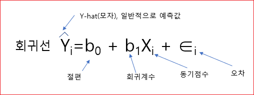
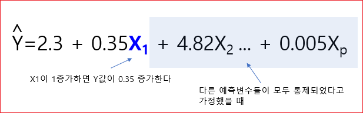
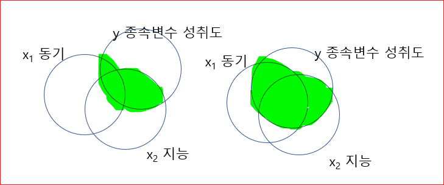

# 회귀분석
회귀 분석은 둘 이상의 변수 간의 관계를 보여주는 통계적 방법이다. 일반적으로 그래프로 표현되는 이 방법은 종속 변수와 독립 변수 간의 관계를 테스트한다. 일반적으로 독립 변수는 종속 변수에 따라 변경되며 회귀 분석은 해당 변경에서 가장 중요한 요소에 대한 답을 찾으려고 시도한다. 


## 변수간의 관계

아래 문장의 의미를 생각해보자. 

**"학습동기가 높으면 학업 성취도가 높다."**

학업동기가 학업 성취도에 영향을 준다는 의미이다. 

여기서, 

* **학습동기를 독립변수라고 한다.**

* **학업성취도를 종속변수라고 한다.**

독립변수는 X를 사용하고 종속변수는 Y를 사용한다. 


예를 들어 학생들의 학습동기를 조사하고 그들의 실제 학업성취도를 조사한다고 가정하자. 

다음과 같은 표로 표현할 수 있다. 


|	학습동기	|	학업성취도	|
|--|--|
|	1	|	2	|
|	3	|	4	|
|	4	|	5	|
|	6	|	7	|
|	9	|	9	|
|	5	|	6	|
|	7	|	8	|
|	8	|	9	|
|	8	|	8	|
|	5	|	7	|
|	4	|	6	|
|	5	|	6	|
|	6	|	7	|
|	7	|	8	|


이 표를 그래프로 그리면 다음과 같다. 


가로(X축)가 학업동기이고 세로(Y축)가 학업성취도이다. 

이것을 산포도 혹은 산점도라고 부르고 영어로는 Scatter plot이라고 부른다. 

전반적으로 분포를 살펴 보았더니 X가 증가함에 따라 Y도 증가하는 것을 볼 수 있다. 

그리고 완전한 직선은 아니지만 어느정도 직선 모양이 보인다. 이러한 관계를 선형관계라고 한다. 


어느정도 상관관계가 있는지 눈으로 확인할 수 있지만 상관관계를 정량화할 방법이 필요하다. 

## 선형관계 정량화 

먼저 X와 Y의 평균을 구한다. 

평균은 보통 바(bar)를 씌어 표시한다. 

그리고, 

X값에서 평균을 빼고 Y 값에서 평균을 뺀다. 

이것을 곱한다. 

다시, 이것을 모든 X와 Y에 대해서 계산하여 더한다. 

그리고 이것을 다시 원소의 갯수로 나눈다. 

이것을 **공분산(Covariance)** 라고 한다. 

```
                     n       _            _
공분산(Covariance) = ∑ (Xi - X)  X ( Yi - Y)
                     i=1
                    ￣￣￣￣￣￣￣￣￣￣￣￣￣￣
                                n
```
공분산은 두 변수의 관련성을 정량화 한 것으로 원래 단위를 그대로 반영하여 계산(비표준화)
한 변수가 평균으로 부터 떨어져 있는 정도 만큼 변수도 평균으로부터 유사하게 떨여져 있는지 측정하는 것이다. 

공분산은 원래 단위를 그대로 사용한다. 예를들어, 키와 몸무게의 경우이다. 

공분산은 상한값이나 하한 값이 없다. 그래서 큰지 작은지 알 수 없다. 

이러한 불편함을 해결하기 위해서 피어슨이라는 사람이 **상관계수(correlation coefficient)** 를 만들게 된다. 

공분산에서 단위를 그대로 쓰기 때문에 단위를 없애야 하는데 표준화를 하게 된다. 

공분산을 표준화하여 -1 ~ +1 사이에 오도록 척도화한다. 


X에서 평균을 빼고 그것을 표준편차로 나눈다. 

```
         _
     X - X
Zx = ----- 
      SDx
```


그럼 상관계수의 크기를 살펴보자. 


X와 Y의 관계가 거의 perfect한 직선의 관계를 가지면 1이 나온다. 반대로 직선이기는 한대 방향이 반대이면 -1이 나온다. 특정한 상관관계가 없을 때 0이 나온다. 


직선에 가까울수록 절대값이 커지고 패턴이 퍼져 있으면 0에 가까운 값이 나온다. 


회귀 분석은 이처럼 두 변수 간의 방향성을 부여하여 독립변수(예측변수)가 종속변수를 '예측' 또는 '설명'한다고 설정한 모형이다. 

상관은 무엇이 원인이고 무엇이 결과인지 알 수 없다.  회귀분석은 동기가 먼저이고 성취도가 영향을 받는다.  


회귀분석은 단순회귀 분석과 다중 회귀 분석이 있는데, 

* 단순 회귀 분석은 독립변수가 하나이고
* 다중 회귀분석은 독립변수를 여러개 투입하여 

종속변수를 설명하고 예측한다. 


## 회귀분석
본격적으로 회귀분석에 대해서 알아보자. 

일반적으로 회귀분석이라고 하면 선형회귀 분석을 말한다. 

**회귀분석이라는 것은 독립변수와 종속변수의 관계를 바탕으로 종속변수를 가장 잘 예측하는 선형적 관계를 추정하는 것을 말한다.** 


Scatter plot에서 **X와 Y의 관계를 가장 잘 대표할 수 있는 직선을 긋고 직선의 식을 산출하는 것**이 회귀분석이다. 


그런데 직선이라근 것은 (X,Y)의 점이 38개라면 38개를 대표하는 선이어야 한다. 

조금더 자세히 설명하자면 선형회귀 모형은  종속변수를 설명하는데 있어서 모형으로 설명하고 모형으로 설명되지 않는 부분은 오차다라고 한다. 

```
종속변수 = 모형 + 오차 
```


아무런 정보가 없는 상태에서 한 학생의 성취도를 맞춰보려고 한다. 랜덤하게 한 학생을 뽑아서 가장 오차가 적게 예측하는 방법은 평균으로부터 예측하는 것이 가장 안전하다. 


안전하다는 것은 오차가 가장 적을 수 있다는 말이다. 

아무런 정보가 없을 때에는 그 학생의 성적은 평균일거야라고 추정하게 된다. 

그런데 이런 추정은 너무 무식한 추정이다. 모형으로서 가치가 없는 것이다. 그냥 찍은 것이다. 아무런 정보도 우리에게 주지 않는다. 


이거 보다 정교한 모형을 써야 하는데, 그래서 **예측변수**를 투입하는 것이다. 


앞에서 설명한 학습동기를 투입한다. 이 학생의 성취 점수는 모르고 학습동기 점수만 알고 있다. 

이 동기 점수를 바탕으로 이 학생이 기말에 어느정도의 성취도를 보일 것인지 예측하려고 한다. 이것이 회귀 분석이다. 

그런데 사실, 이 학생의 실제 데이터는 알고 있다. 하지만 모른다고 가정하자. 

앞에서 전체 학생이 38명이라고 했다. 이 38명의  (x,y)의 관계를 가장 잘 설명하는, 대표할 수 있는 라인을 찾는 것이 회귀분석이다. 

그래서 그 라인을 가장 잘 들어 맞는 라인이다라고 해서 Best fitting line이라고 한다. 

이 라인을 찾는 방법은 나중에 설명하기로 하고 Best fitting line을 찾았다고 가정하자. 

그래서 이게 선이기 때문에 선형 방정식으로 표현할 수 있다. 


그런데 회귀분석에서는 기호를 달리 쓴다. 


절편(B0)와 회귀계수(B1)은 구했다고 치고 동기점수는 알고 있다. 


```
예측값(6.8) = 0.4 + 0.8 * 8 
```

이 학생의 실제점수를 모르고 있다고 해서 예측한 값이 6.8인데, 사실은 알고 있다. 

그래서 예측한 값과 실제 점수사이에는 오차가 존재한다. 이것을 **잔차**라고 한다. 


실제점수에서 평균을 뺀 것을 편차라고 한다. 

```
편차 = 실제점수 - 평균 
편차 = 9 - 5.42
```

그런데 편차를 다시 살펴보면 아래의 식과 같은 것을 알 수 있다 

```
(실제점수 - 평균) = ( 예측점수 - 평균) + (실제점수 - 예측점수)
= 9 - 5.42 = ( 6.8 - 5.42 ) + ( 9 - 6.8 )
```

그러면  (예측 점수 - 평균)은 모형에서 예측(설명)한 것이고 (실제점수 - 예측점수)는 충분히 설명이 안되는 오차이다. 

이렇게 전체 편차를 두 파트로 나누어 볼 수 있다. 

살펴볼 것이 있는데 휘귀선에 대한 공식이 있고 개별 사례에 대한 회귀식이 있다. 

회귀선이라는 것은 38명을 가지고 가장 대표하는 Best Fitting Line을 찾는 것이기 때문에 하나의 선으로 나온다. 개별 사례에 대한 휘귀식은 i번째 학생의 성취도를 예측하는 공식이다. 


아래는 개별 사례에 대한 회귀식이다. 




그러면 절편(B0)와 회귀계수(B1)은 어떻게 구하는가? 


## 회귀계수의 추정

Best Fitting Line은 어떻게 찾을까? 학자들이 생각한 방법이 **최소제곱법(최소자승법: Method of Least Squares)** 이다. 

개별 사례에 대한 잔차를 구한 다음에 그것들을 제곱해서 합을 구해서 그것이 최소가 되도록 하는 직선의 기울기와 Y절편을 구한다. 


```
● 최소제곱법을 이용하여 회귀계수 산출 
  ● "잔차제곱합"이 최소가 되도록 하는 기울기와 Y절편을 구함 
    ● D = ∑(개별 사례에 대한 관측값 - 모형으로부터의 예측값) ^ 2 가 최소가 되도로 하는 직선의 절편(B0)과 회귀계수(B1)값을 구함 
```    

이것을 어떻게 구하나? 미분을 사용해서 구하는데 식은 다음과 같다. 


그래서 절편(B0)와 회귀계수(B1)은 최소제곱법에 의해서 산출되는 값이다라고 이해하면 된다. 


## 회귀계수의 해석 
더 중요한 것은 회귀계수의 해석이다. 

표준화 회귀계수는 다중회귀분석에서 다시 설명하기로 한다. 

비표준화 회귀계수는 각 변수의 단위(척도)를 그대로 살려서 회귀계수를 해석한다. 

회귀계수도 표준화하기 전단계가 있고 표준화된 단계가 있다. 

예를 들어 다음과 같은 회귀식이 있다고 가정한다. 

```
^
Y = -90 + 0.9X 
Y = B0 + B1X 
```

어떤 여성의 키를 알고 있을 때 몸무게를 예측하는 공식에 넣어보자. 키가 160이라고 가정한다.
```
Y = -90 + 0.9 * 160 
  = 54
```
키가 160인 사람의 몸무게는 54가 나온다. 키의 단위인 cm와 몸무게 kg를 그대로 사용한 것이다. 

비표준화 계수를 사용하면 해석가능한 수치로서 예측값을 해석할 수 있다는 장점이 있다. 


### b0
b0는 절편이다.  X가 0일때, Y에 대한 예측값이다. 예를 들어서 어떤 여성의 키가 0일때 몸무게가 -90이다. 사실 이게 말이 안된다.  회귀분석에서는 별 의미는 없다. 

이것을 의미가 있게 해석하려면 중심화(Centering)이라는 것을 사용하기도 한다. 

원래의 값에서 평균을 뺀다. 
```
    _
X - X
```

이것은 평균키에서의 Y값(몸무게)를 의미한다. 


## b1 
b1은 0.9가 b1인데, x=160인 사람과  x  = 161인 사람의 몸무게 차이 
차이는 160인 사람은 50 kg,161인 사람은 54.9이다.  그래서, x가 1증가할 때 0.9kg 증가한다고 예측한다. 


## 다중 회귀분석 
다중 회귀분석은 단순회귀분석과 원리는 동일하지만 예측(설명) 변수의 수가 2개 이상인 경우, 각 예측(설명) 변수의 고유한 예측력(설명력)을 분석한다. 


### 회귀계수의 해석 
단순 회귀분석과 유사한데 다른 점은 다른 예측변수를 통제한 상태에서 해석을 한다는 것이다. 


종속변수가 성취도이고 X1이 동기이고, X2가 지능이라고 가정한다.  성취도를 설명함에 있어 동기가 설명하는 부분이 있고, 지능이 설명하는 부분이 있다. 


또 동기화 지능이 겹치는 부분이 있다. 

지능이 없는 상태에서 동기만 가지고 성취도를 설명한다고 하면 원의 교집합에 해당하는 원의 전체가 될 것이다. 

또 동기를 고려하지 않고 지능만 가지고 성취도를 설명한다면 지능에 해당하는 원의 전체가 될 것이다. 


그런데 이번에는 동기화 지능을 동시에 투입을 했다. 그러면 동기화 지능이 공동으로 성취도를 설명하는 부분이 있을 것이다. 

하지만 공동으로 설명하는 부분은 딱히 동기로만으로도 설명할 수 없고, 지능만으로도 설명하기 어렵다. 


그래서 다른 예측변수를 고려(통제)한 상태에서 한 예측변수의 값이 1점 올라 갈 때 Y값이 몇 점 올라갈 것으로 기대하는 것이 회귀계수의 해석이다. 

**b0** 

절편이다. 모든 예측변수의 값이 0일 때 Y값이다. 


**b1**

1번부터 p번까지의 예측변수가 있다. 나머지 예측 변수의 영향력을 통제한 상태에서 첫번째 예측변수가 고유하게 예측하는 부분이 어느정도인지를 설명한다. 


**b2** 

X2 예측변수를 제외한 나머지 예측 변수의 영향력을 통제한 상태에서 X2 예측변수가 고유하게 예측하는 부분이 어느정도인지를 설명한다. 

예를들면 아래 그림에서 다른 예측변수들이 모두 통제 되었다고 가정할 때 X1이 1증가하면 Y값이 0.35 증가한다고 해석한다. 




언뜻보기에 가장 영향력이 큰 변수는 얼핏보기에는 X2의 계수가 4.82로 제일 크기 때문에  X2인 것 같지만 그것은 잘못된 것이다. 왜냐하면  이 회귀 계수들은 비표준화 회귀 계수이기 때문이다.  단위(척도)가 살아 있기 때문이다. 


### 표준화 회귀계수 (베타 계수)

**비 표준화 회귀 계수는 원래 단위를 그대로 유지한 상태에서 해석하므로 실제적인 의미를 가지는 해석이 가능하다는 장점이 있지만, 여러 예측변수들의 상대적인 영향력을 비교하는데에는 한계가 있다.**


변수를 표준화하면 공통의 단위를 사용하는 효과가 발생하므로, 각 예측변수의 상대적인 영향력을 비교할 수 있다는 장점이 있다. 

비표준화 회귀식과 똑 같지만 베타(β)로 바꾼다. 


예측변수가 X1, X2 두 개인 경우 회귀 계수 공식 


### 표준화 회귀계수의 해석 
비표준화 회귀계수와 논리는 똑같다. 그러나 차이가 있다면, 표준화 회귀계수는 단위를 없앴기 때문에 1점이라던가, 1cm라는 단위를 사용할 수 없다. 그렇기 때문에 표준편차를 한단위로 사용해야 한다. 

그래서 다른 예측변수를 통제한 상태에서 한 예측변수의 값이 1SD 단위 올라갈 때 Y 값은 몇 SD 단위 올라갈 것으로 기대하는가로 해석해야 한다. 

X라는 변수가 평균이 100이고 표준편차가 20인 그러한 점수체제를 가지는 변수라고 생각을 해보자.  이때 20이라는게 표준편차이다. 표준화한 다음에는 20을 하나의 묶음으로 봐서 1SD는 20이다. 한 단위가 올라 갔을 때 Y도 표준편차 단위로 해석을 해야 한다. 


```
학업성취도 = 01.4 - 0.25X(시험불안) + 0.4 X(학습동기) + 0.37 X (과제집착력)
```
위의 공식을 살펴보면 이제는 표준화된 계수이기 때문에 상대적인 영향력을 비교할 수 있다.  따라서 위의 식에서 학습동기에 대한 계수가 제일 높다. 그래서 학습동기가 나머지 변수들에 비해 학업성취도를 가장 잘 예측하는 번수라고 해석할 수 있다. 


### 다중상관(Muiltiple Correlation)

상관이라는 것은 X라는 변수와 Y라는 변수가 어느정도를 공유하고 있는가라는 개념으로 생각하면 된다. 

Y라는 변수가 X1, X2 두 변수가 통합적으로 어느정도와 상관을 가지는가, 가지는 관계를 다중상관이라고 한다. 


* 종속변수 한 개와 여러 개의 독립변수 간의 관계
* 관찰된 종속변수와 예측된 종속변수간의 관계 


실제 Y값과 예측된 Y값의 상관계수를 구하는 게 다중상관이다. 

**다중상관 제곱(R2: 결정계수)**

그냥 쓰지 않고 일반적으로 제곱을 해서 쓰고 R제곱이라고 부르는데
다른말로 결정게수 이다. 


X1과 X2가 설명하는 부분이 아래 그림에서 초록색으로 칠한 부분이고 이것이  R제곱이다. 


아래에서 왼쪽과 오른쪽을 비교해 보면 오른쪽의 X1이 Y를 설명하는 부분의 영역이 크고 
, X2가 Y를 설명하는 영역이 크다. 




R스퀘어가 클수록 회귀모형에 포함된 예측변수들의 설명력(예측력)이 높다. 


