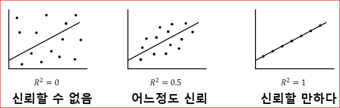

# 회귀분석 (6) 


선형 회귀 그래프로는 산점도(Scatter plots)를 많이 활용한다. 그리고 독립 변수와 종속 변수 간의 상관관계를 나타내는 척도를 상관 계수(correlation coefficient)라고 한다.상관 계수는 보통 r로 표기합니다. 여러 상관 계수가 있지만 선형 회귀의 상관 계수로 가장 많이 쓰이는 것은 피어슨 상관 계수(Pearson correlation coefficient)이다.  피어슨 상관 계수는 선형 관계의 강도(Strength)와 방향(Direction)을 나타내며, -1부터 1 사이의 값으로 표시한다.  선형 계수가 -1일 수록 음의 상관관계를 가지고, 1일 수록 양의 상관관계를 가진다. 

* 강도(Strength) 
  * Strong       0.7 ≤ | r | ≤ 1.0 
  * Moderate     0.3 ≤ | r | ≤ 0.7 
  * Weak         0.0 ≤ | r | ≤ 0.3 

* 방향(Direction)
  * Positive  r > 0 
  * Negative  r < 0


피어슨 상관 계수는 선형 관계일때만 유의미하고, 아래 그래프처럼 2차식에서는 의미가 없다. 아래 2차식의 피어슨 상관 계수는 0입니다. r=0일 때는 상관관계가 없다고 보지만 아래 2차 식이 실제로 상관관계가 없는 것은 아니다.  피어슨 상관 계수는 선형 관계일 때만 쓴다. 


## 최소자승법(OLS : Least-squres Method) 

* 최소자승법(OLS : Least Square Method)

산점도로 데이터의 분포 그래프를 그렸을 때, 이 데이터들의 경향을 알고 싶다면 추세선을 그린다. 어떤 데이터가 주어졌을 때 최적의 추세선을 그리기 위한 방법 중 하나가 최소자승법 (Least-squares Method)이다. 데이터의 추세선을 그리고 싶을 때 쓰는 방법이 최소자승법이다. 


### 자승법을 활용한 회귀선(Regression line) Fitting


**모형 수식** 

```
Y = -17.5791 + 3.9324 * X 
```


* 절편(intercept)
  * 회귀직선의 절편.
  * x=0일 때의 예측값으로 b0 또는 β0로 표기. 즉, speed가 0 일 때 y절편은 - 17.5791

* 회귀계수(regression coefficient)  
  * 회귀직선의 기울기. b1 또는 β1로 표기
  * 기울기(slope), 모수 추정값(parameter estimate),  가중값(weight)


* 상관계수(correlation coefficient)
  * 두 변수의 상관성을 나타내는 척도이다. 
  * 항상 -1과 1 사이의 값을 가지며( -1 ≤ r ≤ +1), 계수 값이 -1 또는 1일때 두 변수가 완전한 직선관계임을 뜻한다.

* 결정계수(R-squared)
  * R^2(R제곱)으로 표시 
  * 독립변수가 종속변수를 얼마나 잘 설명해주는지 보여주는 지표이다. 
  * 문제는 독립변수의 개수가 증가하면 함께 증가한다. 그러므로 결정계수에만 의존하여 회귀모델을 평가하는데에는 루미가 있다. 따라서 조정된 결정계수(Adjusted R-squared)가 제시되었다. 
  * 모형의 예측 정확도가 높아지면 결정계수가 1에 가까워진다
  * 회귀식이 얼마나 정확한지를 나타내는 숫자가 결정계수이다.  기호는 R2을 사용한다. 보통 숫자 0부터 1까지만 사용한다. ( 0 ≤ R2 ≤ 1 ). 
  * R2가 0.4라면 40%의 설명력을 가진다고 해석하면된다. 
  * 결정계수는 독립변수 개수가 증가하면 함께 증가하므로 독립변수 개수가 2개 이상일 경우에는 조정된 결정개수를 사용해야 한다. 


> 회귀분석 중 독립변수 하나로 분석을 시행하는 경우, y= a + b*x 에서 나오는 결정계수는 x, y의 상관계수의 제곱이다. 즉, 단순회귀의 경우 "상관계수의 제곱 = 결정계수의 제곱"가되는것이다.


> 다중회귀의 경우  y = a + b1*x1 + b2*x2 에서 나오는 결정계수는 독립변수들(x1, x2)이 y를 얼마나 설명하냐를 나타낸다. 따라서 이 경우의 상관분석은 (y, x1)의 상관계수와 (y, x2)의 상관계수를 각각 구해야한다.


## smmmary 항목 설명

* Dep. Variable: Dependent variable, 즉 종속변수를 의미한다.
* Model: 모델링 방법을 뜻하고, OLS는  Ordinary Least Squares의 약자이다.
* No. Observations: Number of observations, 관찰표본 수, 즉 총 표본 수를 뜻한다. 
* Df Model: 독립변수의 개수이다.
* R squared: R의 제곱이라는 뜻이고 결정계수를 의미한다. 전체 데이터 중 해당 회귀모델이 설명할 수 있는 데이터의 비율, 회귀식의 설명력을 나타낸다. SSTr/SST이나 상관계수 R을 제곱해서 구할 수 있다. 
* F-statistics: F통계량을 뜻한다. F통계량은 MSR/MSE로 구할 수 있다. 
* Prob: F통계량에 해당하는 P-value를 의미한다. P는 Probability의 첫글자이다.
* Intercept coef: Intercept coefficient는 회귀식의 절편 값을 의미한다.
* speed coef: 독립변수 coefficient는 독립변수 "speed"의 회귀계수를 의미하며, 회귀식에서 기울기를 의미한다. 

* std err : 계수 추정치의 표준오차(standard error), 값이 작을 수록 좋음 
* t : t-test 독립변수와 종속변수 사이의 상관관계. 값이 클 수록 상관도가 큼 
* p-value(p > |t|) : 독립변수들의 유의확률, 0.05보다 작아야 유의미함. 
* [0.025 0.975] : 회귀 계수의 신뢰구간 
* coef(Coefficient) : 회귀 계수 
* Omnibus : 디아고스티노 검정(D'Angostino's Test). 비대칭도와 첨도를 결합한 정규성 테스트이며 값이 클 수록 정규 분포를 따름 
* Prob(Omnibus) : 디아고스티노 검정이 유의한지 판단(0.05이하일 경우 유의하다고 판단)


https://lovelydiary.tistory.com/348


### 결정계수 
회귀식이 얼마나 정확한지를 나타내는 숫자가 결정계수이다. 결정계수가 0에 가까울 수록 "회귀식의 정확도는 매우 낮다"고 할 수 있고 1에 가까울 수록 "회귀식읜 정확도는 매우 높다"고 할 수 있다. 





결정계수에도 한계가 있는데 수치가 어중간할 경우에는 정확도를 판단하기가 애매해진다.  예를들어 0.4가 나올 경우는 판단하기 애매하다. 그래서 회귀식의 정확도가 애매할 경우에 해당 회귀식의 결과를 신뢰할지 여부를 판단해야 하는데 결정계수로 의사결정을 못한다. 


그래서 가설검정을 통해서 이러한 의사결정을 한다. 


## 회귀 모형 검정 

### 회귀모형은 타당한가? 
* 귀무가설 : 회귀모형은 타당하지 않다.
* 대립가설 : 회귀모형은 타당하다.

**결과**   
* F-statistic : 검정통계량 = 1334
* Prob (F-statistic) : P-value = 0.012

유의확률이 0.0012이므로 유의수준 0.05에서 회귀모형은 통계적으로 유의하게 타당한 것으로 나타났다.

### X는 Y에게 영향을 주는가? 


* 귀무가설 : X는 Y에게 영향을 주지 않는다.
* 대립가설 : X는 Y에게 영향을 준다.

**결과**    


* coef : 회귀계수 (beta_1) = 0.667
* std err : 표준오차 (standard error) = 0.018
* t : 회귀계수 / 표준오차 = 0.667 / 0.018 = 36.530
* P > |t| : P-value = 0.000

유의확률이 0.000이므로 유의수준 0.05에서 꽃받침의 길이는 꽃잎의 길이에 통계적으로 유의한 영향을 주는 것으로 나타났다.


### X는 Y에게 어떤 영향을 주는가?
* 회귀계수의 값이 크면 X가 Y에게 많은 영향을 준다.
* 회귀계수의 값이 작으면 X가 Y에게 작은 영향을 준다.
* 회귀계수의 부호가 +이면 X가 Y를 증가시키는 영향을 준다.
* 회귀계수의 부호가 -이면 X가 Y를 감소시키는 영향을 준다.


**결과**     
* coef : 회귀계수 = 0.667

꽃받침의 길이가 1cm 증가하면 꽃잎의 길이는 약 0.667cm 증가시키는 영향을 준다.


### 회귀모형의 설명력 또는 X의 설명력 

* Y의 다름(변동)을 회귀모형이 얼마나 설명하고 있는가?
* Y의 다름(변동)을 X가 얼마나 설명하고 있는가?

**결과**     
* R-squared (uncentered) = 0.900
* 회귀모형이 Y의 다름(변동)을 약 90.0% 정도 설명하고 있다.

X가 Y의 다름(변동)을 약 90.0% 정도 설명하고 있다.


**MSE**
```python 
from sklearn.metrics import mean_squared_error

mean_squared_error(y_true = , y_pred = )
```

* 회귀 모델의 적합도를 나타내는 척도로 0에 가까울 수록 적합도가 높음


### 예측(Prediction) 

```python 
model.predict(exog = X)
```


### 회귀모형의 진단 또는 가정 
**잔차(오차) 검정** 
회귀 모형을 통해 구한 조건부 평균이 실제 데이터를 잘 대표하는 값이 되려면 잔차가 정규성, 독립성, 등분산성이라는 가정을 만족해야 한다.  


#### 정규성 검정 
Residuals는 잔차의 정규성을 개략적으로 확인할 때 사용한다. 

모델의 잔차들을 직접 이용해서 정규성을 확인하는 것이 좋다. 만약 잔차가 정규 분포에 가깝다면, 표시된 잔차들이 대각선으로 그려진 점선에 가깝게 표시된다. 

* 귀무가설 : 정규분포를 따른다. 
* 대립가설 : 정규분포를 따르지 않는다. 
* Jarque-Bera Normality tes t
* Jarque-Bera(JB) = 
* Prob(JB) = 
* 유의확률이 0.011이므로 유의수준 0.05에서 정규성 가정이 깨짐 


#### 독립성 검정

잔차의 독립성을 보기 위해 세가지를 확인한다. 
* 회귀 모델을 통해 구한 예측값과 잔차와의 독립성
* 잔차와 회귀 변수 사이의 독립성
* 잔차끼리의 독립성 

* 귀무가설: 독립이다
* 대립가설: 독립이 아니다 
* Durbin-Watson = 1.676

> * DW 값이 2에 가까우면 오차들은 독립
> * DW 값이 0에 가까우면 독립 X, 양의 자기상관 O
> * DW 값이 4에 가까우면 독립 X, 음의 자기상관 O


#### 등분산성 검정 
잔차의 등분산성이란 잔차가 회귀모델의 예측치 값에 상관없이 분산이 일정하다는 뜻이다. 


* 귀무가설 : 등분산이다.
* 대립가설 : 등분산이 아니다

```
stats.bartlett(X, residuals)
```

* 유의확률이 0.012이므로 유의수준 0.05에서 등분산 가정이 깨짐


