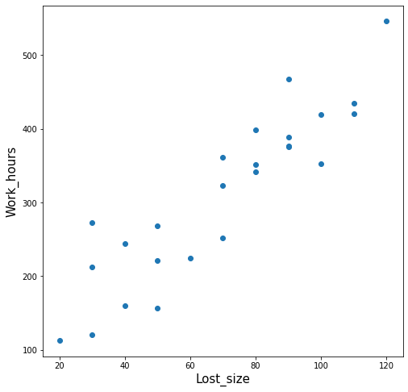
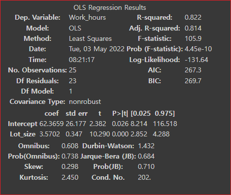

# Python을 이용한 회귀분석 예제 


## 데이터 살펴보기 

```python 
import pandas as pd
import matplotlib.pyplot as plt
import matplotlib

matplotlib.rcParams['axes.unicode_minus'] = False ## 마이나스 '-' 표시 제대로 출력

from statsmodels.formula.api import ols
from sklearn.linear_model import LinearRegression
 
df = pd.read_csv('drive/MyDrive/data/toluca_company_dataset.csv') ## 데이터 불러오기
# df = pd.read_csv('drive/MyDrive/data/speed.csv') ## 데이터 불러오기 
```

데이터를 5개만 출력해본다. 
```python 
df.head(5)
```

Lot_size는 제품크기이고 Work_hours는 작업시간이다. 


```
Lot_size	Work_hours
0	80	399
1	30	121
2	50	221
3	90	376
4	70	361
```
데이터 분포를 살펴보자. 


## 데이터 분포 확인 

```python 
## 시각화
fig = plt.figure(figsize=(8,8))
fig.set_facecolor('white')
 
font_size = 15
plt.scatter(df['Lot_size'],df['Work_hours']) ## 원 데이터 산포도
# plt.scatter(df['speed'],df['dist']) ## 원 데이터 산포도
 
plt.xlabel('Lost_size', fontsize=font_size)
plt.ylabel('Work_hours',fontsize=font_size)
plt.show()
```





## 모형 적합시키기 
### statsmodels 라이브러리 이용

statsmodel에서 OLS를 사용한 선형 회귀 분석 배치.
OLS는 ordinary least square의 약자로 최소자승법으로 회귀 모델을 구하는 메서드이다. (Reference4)


모델이 얼마나 효율적으로 배치되는지 확인하기 위한 모델 요약


```python 
from statsmodels.formula.api import ols
from sklearn.linear_model import LinearRegression
```

### ols('y ~ x', data).fit() 모형 적합시키기 
'y ~ x1 + x2 + x3' -> 독립변수가 여러개 일 경우에는 + 로 추가해준다. 


```python 
## states model 사용
fit = ols('Work_hours ~ Lot_size',data=df).fit() ## 단순선형회귀모형 적합
# fit = ols('dist ~ speed',data=df).fit() ## 단순선형회귀모형 적합
```
결과를 요약하여 제공한다. 

```python 
fit.summary()
```





회귀식은
```
Y = B0 + B1X
```
이므로 휘귀식에 값을 적용해 보자. 

```
Y = 62.3659 + 3.5702 * X 
```
* B0 = 절편(intercept) : 62.3659
* B1 = 기울기 = 회귀계수 = Lot_Size coef : 3.5702
* R-squared = 결정계수 = 0.822
* intercept의 p-value = 0.026


### 해석 
* X가 0일때 Y 값은 62.3659
* 결정계수가 0.8이므로 1과 가깝다. X가 Y를 80% 설명한다. 어느정도 신뢰할 만하다. 


독립변수가 하나이므로 가설을 세울필요는 없지만 가설을 세워보자.

* H0 귀무가설 : 제품크기가 크면 제품크기와 작업시간은 차이가 없다. 
* H1 대립가설 : 제품크기와 작업시간은 차이가 있다. 

가설검정을 통해

* 95%의 신뢰도를 기준으로 p-value는 0.05보다 작은 0.026 이므로 잘못될 확률은 2%이므로 유의 확률이 0.02라면 귀무가설을 기각했을때 이 기각 결정이 잘못될 확률이 2%라는 것이고 기각 결정이 잘못될 확률이 너무 작기 때문에 과감하게 기각해도 된다고 해석이 가능해진다. 따라서  귀무가설을 기각하고 
* 대립가설을 채택한다. 즉, 제품크기가 커지면 작업시간이 늘어난다. 


https://zephyrus1111.tistory.com/52


## 해석


https://velog.io/@pyose95/Data-Analysis-15.-%EB%8B%A8%EC%88%9C%EC%84%A0%ED%98%95-%ED%9A%8C%EA%B7%80%EB%B6%84%EC%84%9D-Simple-Linear-Regression-Analysis-2