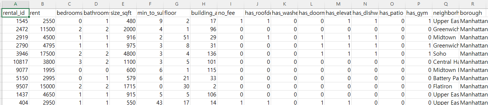

# 파이썬을 사용한 다중회귀분석(Multiple Linear Regression) 

세상은 단순선형회귀로 설명할 수 있을만큼 다순하지 않다. 고려해야할 변수 X가 하나가 아니다. 예를들어 주택 임대료를 예측한다고 했을 때, 주택의 면적만 고려해서 예측한다면 단순회귀가 되겠지만, 지어진지 얼마나 오래되었는지, 지하철 역과의 거리가 얼마나 가까운지 등 다양한 요소의 영향을 받는다. 결국 주택 임대료 y를 예측하려면 여러개의 변수 X를 포함해야 한다. 이를 다중선형회귀(Multiple Linear Reression)라고 한다. 

다중회귀분석에 대한 이해는  [다중 회귀분석](regress-05.md)을 참고한다. 

데이터는 github에서 다운로드 받는다. 
[여기](https://github.com/Codecademy/datasets/blob/master/streeteasy/manhattan.csv)  

맨 왼쪽의 rent가 임대료이다. 

##  데이터 셋 분리하기

모든 데이터를 사용하여 다중선형회귀 모델을 만들 수도 있지만 학습데이터와 시험데이터를 분리할 것이다.  

데이터 셋 분리는 sklearn에서 train_test_split 를 통해 할 수 있다. 

## 참조
[학습과 테스트 세트분리](https://teddylee777.github.io/scikit-learn/train-test-split)       

[다중선형회귀분석](https://hleecaster.com/ml-multiple-linear-regression-example/)    

