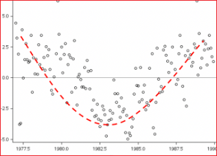

# 최소자승법(OLS)를 이용한 단순 선형회귀


* 최소자승법(OLS : Least Square Moehod)


선형 회귀 그래프로는 산점도(Scatter plots)를 많이 활용한다. 그리고 독립 변수와 종속 변수 간의 상관관계를 나타내는 척도를 상관 계수(correlation coefficient)라고 한다.상관 계수는 보통 r로 표기합니다. 여러 상관 계수가 있지만 선형 회귀의 상관 계수로 가장 많이 쓰이는 것은 피어슨 상관 계수(Pearson correlation coefficient)이다.  피어슨 상관 계수는 선형 관계의 강도(Strength)와 방향(Direction)을 나타내며, -1부터 1 사이의 값으로 표시한다.  선형 계수가 -1일 수록 음의 상관관계를 가지고, 1일 수록 양의 상관관계를 가진다. 

* 강도(Strength) 
  * Strong       0.7 ≤ | r | ≤ 1.0 
  * Moderate     0.3 ≤ | r | ≤ 0.7 
  * Weak         0.0 ≤ | r | ≤ 0.3 

* 방향(Direction)
  * Positive  r > 0 
  * Negative  r < 0


피어슨 상관 계수는 선형 관계일때만 유의미하고, 아래 그래프처럼 2차식에서는 의미가 없다. 아래 2차식의 피어슨 상관 계수는 0입니다. r=0일 때는 상관관계가 없다고 보지만 아래 2차 식이 실제로 상관관계가 없는 것은 아니다.  피어슨 상관 계수는 선형 관계일 때만 쓴다. 





# 최소자승법(Least-squres Method) 
산점도로 데이터의 분포 그래프를 그렸을 때, 이 데이터들의 경향을 알고 싶다면 추세선을 그린다. 어떤 데이터가 주어졌을 때 최적의 추세선을 그리기 위한 방법 중 하나가 최소자승법 (Least-squares Method)이다. 데이터의 추세선을 그리고 싶을 때 쓰는 방법이 최소자승법이다. 최소자승법은 [회귀분석](README.md)를 참고한다. 


## 자승법을 활용한 회귀선(Regression line) Fitting


**모형 수식** 

```
Y = -17.5791 + 3.9324 * X 
```


* 절편(intercept)
  * 회귀직선의 절편.
  * x=0일 때의 예측값으로 b0 또는 β0로 표기. 즉, speed가 0 일 때 y절편은 - 17.5791

* 회귀계수(regression coefficient)  
  * 회귀직선의 기울기. b1 또는 β1로 표기
  * 기울기(slope), 모수 추정값(parameter estimate),  가중값(weight)


* 상관계수(correlation coefficient)

* 결정계수(R-squared)
  * R2(R제곱)으로 표시 
  * 독립변수가 종속변수를 얼마나 잘 설명해주는지 보여주는 지표이다. 
  * 문제는 독립변수의 개수가 증가하면 함께 증가한다. 그러므로 결정계수에만 의존하여 회귀모델을 평가하는데에는 루미가 있다. 따라서 조정된 결정계수(Adjusted R-squared)가 제시되었다. 
  * 모형의 예측 정확도가 높아지면 결정계수가 1에 가까워진다
  * 회귀식이 얼마나 정확한지를 나타내는 숫자가 결정계수이다.  기호는 R2을 사용한다. 보통 숫자 0부터 1까지만 사용한다. ( 0 ≤ R2 ≤ 1 ). 
  * R2가 0.4라면 40%의 설명력을 가진다고 해석하면된다. 
  * 결정계수는 독립변수 개수가 증가하면 함께 증가하므로 독립변수 개수가 2개 이상일 경우에는 조정된 결정개수를 사용해야 한다. 


## 결정계수 
회귀식이 얼마나 정확한지를 나타내는 숫자가 결정계수이다. 결정계수가 0에 가까울 수록 "회귀식의 정확도는 매우 낮다"고 할 수 있고 1에 가까울 수록 "회귀식읜 정확도는 매우 높다"고 할 수 있다. 


결정계수에도 한계가 있는데 수치가 어중간할 경우에는 정확도를 판단하기가 애매해진다.  예를들어 0.4가 나올 경우는 판단하기 애매하다. 그래서 회귀식의 정확도가 애매할 경우에 해당 회귀식의 결과를 신뢰할지 여부를 판단해야 하는데 결정계수로 의사결정을 못한다. 


그래서 가설검정을 통해서 이러한 의사결정을 한다. 


https://forensics.tistory.com/73

https://aliencoder.tistory.com/34


