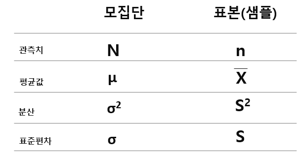

# T 검정 


## 1
> t 검정 (t-test)     
모집단의 분산이나 표준편차를 알지 못할 때
모집단을 대표하는 표본으로부터 추정된 분산이나 표준편차를 가지고 검정하는 방법으로
“두 모집단의 평균간의 차이는 없다”라는 귀무가설과 “두 모집단의 평균 간에 차이가 있다”라는 대립가설 중에 하나를 선택할 수 있도록 하는 통계적 검정방법이다.    
(교육평가용어사전, 2004, 학지사)


**왜 이름이 t-test인가?**    
가설이고 정확히 알려지지 않았다. 
1908년 영국의 William Sealy Gosset이 개발한 방법
그의 필명이 Student였다고 함. 
Student의 마지막 글자 't'를 땨서 t-test라고한다. 


## t-test의 목적 
* 두 개의 집단이 같은지 다른지 비교하기 위해 사용한다. 

통계에서는 일반적으로 집단이란 샘플(표본)을 이야기 한다. 
그러나 샘플만 존재하는 것은 아니다. 
모집단(population)이라는 것도 있다. 
팸플(표본)과 모집단은 어떻게 다른가? 





무엇을 가지고 비교할까?  

두 집단이 같은지 다른지 알기 위해서는 두 표본의 평균값을 가지고 비교한다. 

두 샘플의 대푯값이 평균을 가지고 비교한다. 


t-test의 예 

* A대학 남학생 평균키 = 178.5cm 
* B대학 남학생 평균키 = 179.9cm 


두 대학 남학생의 평균키의 차이는 1.4cm 차이가 난다.  
그러면 두 대학 남학생의 키는 같을까요? 다를까요? 

1.4cm는 큰차이일까요? 같은 차이일까요? 


t-test를 위한 통계적 질문 
* A대학 남학생 평균키(178.5cm)와 B대학 남학생 평균키(179.9cm)가 우연히 같은 확률은 얼마나 될까? 
* A대학과 B대학의 남학생 평균키 차이인 1.4cm가 우연히 발생했을 확률은 얼마나 될까? 


t-test의 목적은 두 집단이 같은지 다른지 알고 싶을 때 하는 것이고, 그것을 비교하기 위해 두 집단의 평균값을 비교하고, 그 때 우리가 해야 할 질문은 두 집단의 차이가 우연히 발생할 수 있는 확률을 구함으로써 t-test의 결론을 내리는 것이다. 


## 2 

t-test를 위한 통계적 질문 
* 그렇다면 관연 1.4cm의 차이가 얼마나 커야 우연히 발생하지 않았다고 판단할 수 있을까? 
* 1.4cm의 차이는 과연 큰 것인가 작은 것인가? 


결정론적 사고에서는 A대학 학생의 키가 B대학의 학생보다 1.4cm 크다. 
그러나 통계적 의사결정을 그렇지 않다. 


t-test에 대한 보다 깊은 이해 
* 우리는 1.4cm가 얼마나 큰지 혹은 작은지 알 수 없다. 
* 우리는 이제 이 1.4cm가 얼마나 큰지 혹은 작은지 결정할 나름의 비교 대상이 필요하다. 
* 누구를 가지고 와서 비교해야 할까요? 

이것 하나 있다. 

표준편차(분산)

왜 표준편차가 비교의 대상일까요? 다시 돌아가 보자. 
* 우리가 가진 자료고 { 1,2,3,4,5} 이렇게 되어 있다면, 평균은 3이고 
* 분산
```
     (1-3)^2 + ( 2 -3)^2 + (3-3)^2 + (4-3)^2 + (5-3)^2 
분산 --------------------------------------------------------  = 2.5
                            4
``` 
      
* 표준편차 = 1.58 


표준편차의 의미를 다시 생각해 보자. 

* 여기서 우리가 가진 데이터는 평균값 3을 중심으로 평균적으로 1.58만큼 퍼져 있다는 의미
* 3 -1.58은 = 1.,42 & 3 + 1.58 = 4.58 
* 그렇다면, 이렇게 3을 중심으로 ± 1.58 정도 퍼져 있다는 것은 의미있는 중요한 퍼짐일까? 아니면 우연히 발생한 퍼짐일까? 


t-test에 대한 보다 깊은 이해 
* 그렇다. 표준편차는 데이터에 큰 문제가 없는 한은 의미 없는 우연히 퍼져 있는 정도이다. 
* 즉, 우리의 데이터는 평균값 3을 중심으로 랜덤하게 1.58정도 좌우로 퍼져 있다는 것이다. 
* 그렇다면, 다시 앞의 1.4cm 차이로 돌아가 보자. 
* 이 1.4cm의 차이도 결국 두 집단의 평균적인 거리이다. 
  * 왜냐하면, 두 집단의 수많은 데이터의 평균의 차이가 1.4cm라는 것은 두 집단의 수많은 데이터들 사이의 평균적인 거리가 1.4cm라느 의미이기 때문이다. 


* 그렇다면 비교해보자
  * 두 집단 A와 B의 데이터 사이의 평균적인 거리는 1.4cm이다. 
  * 두 집단 A와 B의 데이터들의 표준편차는 XXXcm이다. 
* 따라서
  *  만약 이 1.4cm가 표준편차 XXXcm보다 현저히 작다면, 우리는 1.4cm의 차이에 큰의미를 둘 수 없을 것이다. 
  * 그러나 1.4cm가 표준편차 XXXcm보다 현저히 크다면, 우리는 이 1.4cm의차이에 큰 의미를 둘 수 있을 것이다. 


# 참고 
[Youtube t-test (1)](https://youtu.be/mEWQ_vl3IPw)    
[Youtube t-test (2)](https://youtu.be/D_wJuKIADEU)     


